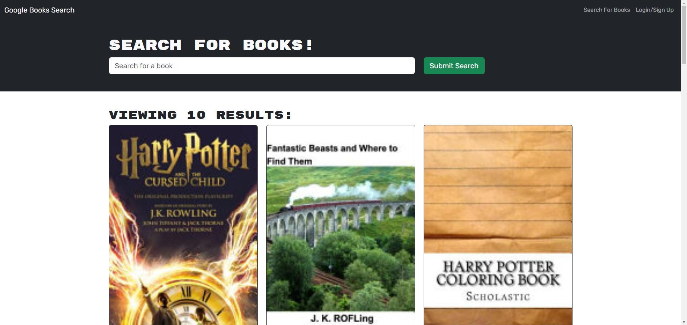

# Mod-21-MERN-Book-Search-Engine

## Description

A Google book search that allows the user to save books in their personal list.  It originally was written as RESTful APIs and has been refactored for GraphQL. 

## Installation

Project has a dependencies the user must run npm install to include the needed libraries. Once all libraries are installed, the react front end must be built.

## Usage

To run locally, run "npm i && npm run build && npm run start" from the installed folder. 

The following image shows the application's appearance:

Project is also deployed to https://mod-21-mern-book-search-engine-production.up.railway.app

## Credits

Created from RESTful starter code

## License

N/A
